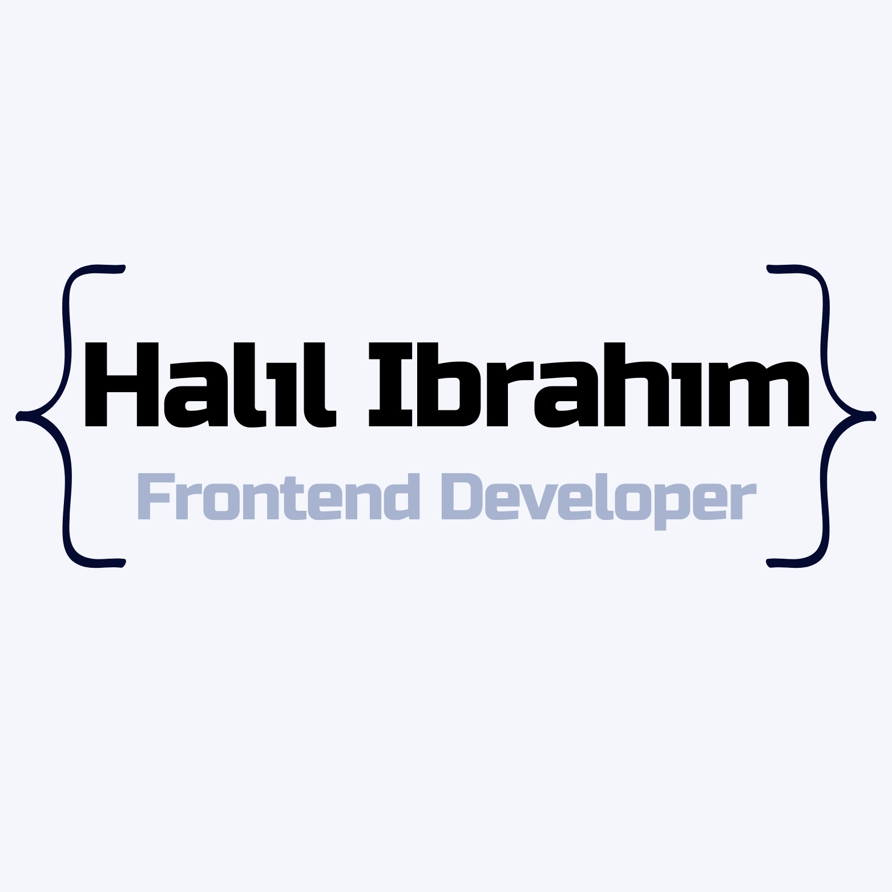

# My portfolio



Welcome to my personal website, where I showcase my skills, projects, and expertise as a Frontend Developer. Visit the live site at [halilibrahim.dev](https://www.halilibrahim.dev/).

## ✨ Features

- **Interactive UI/UX** - Modern design with smooth animations and transitions
- **Dark/Light Theme** - Personalized viewing experience with theme preference saved to local storage
- **Responsive Design** - Optimized for all device sizes (mobile, tablet, and desktop)
- **Project Showcase** - Detailed project pages with descriptions and technologies used
- **Contact Form** - Easy way to reach out and connect with me
- **Sticky Social Links** - Quick access to my professional profiles
- **Dynamic Content** - Content managed through CMS for easy updates

## 🛠️ Tech Stack

### Frontend

- **Framework:** [Next.js](https://nextjs.org/)
- **UI Library:** [shadcn/ui](https://ui.shadcn.com/)
- **Form Management:** [React Hook Form](https://react-hook-form.com/)
- **State Management:** [Context API](https://reactjs.org/docs/context.html)
- **Animations:** [Framer Motion](https://www.framer.com/motion/) & [React Type Animation](https://www.npmjs.com/package/react-type-animation)
- **Styling:** [Tailwind CSS](https://tailwindcss.com/)

### Backend

- **CMS:** [Contentful](https://www.contentful.com/)
- **API:** [Apollo Client](https://www.apollographql.com/docs/react/)

## 🚀 Getting Started

### Prerequisites

- Node.js (v16+)
- pnpm, npm, or yarn

### Installation

1. Clone the repository:

   ```bash
   git clone https://github.com/yourusername/personal-portfolio.git
   cd personal-portfolio
   ```

2. Install dependencies:

   ```bash
   pnpm install
   ```

3. Create a `.env` file in the root directory with your credentials:

   ```
   # Contentful
   CONTENTFUL_SPACE_ID=your_space_id
   CONTENTFUL_ACCESS_TOKEN=your_access_token

   # Database
   DATABASE_URL=your_neon_db_url
   ```

4. Run the development server:

   ```bash
   pnpm dev
   ```

5. Open [http://localhost:3000](http://localhost:3000) in your browser.

## 📋 Project Structure

- `src/app/` - Next.js application pages
- `src/components/` - Reusable UI components
- `src/lib/` - Utility functions and API clients
- `src/providers/` - React context providers
- `src/hooks/` - Custom React hooks
- `src/types/` - TypeScript type definitions
- `public/` - Static assets

## 🌟 Core Features Implemented

- [x] **Dark/Light Theme Toggle** with CSS variables and Context API
- [x] **Responsive UI Components** using shadcn/ui
- [x] **Projects Page** with detailed project information
- [x] **Contact Form** with React Hook Form
- [x] **Sticky Social Links Header** for easy profile access
- [x] **Content Management** via Contentful CMS
- [x] **Animations** using Framer Motion

## 🔮 Future Enhancements

- [ ] Blog section with technical articles and tutorials
- [ ] Advanced animations and page transitions
- [ ] Improved accessibility features
- [ ] Performance optimizations

## 📝 License

MIT

---

Built with ❤️ by [Halil Ibrahim Celik](https://www.halilibrahim.dev)
